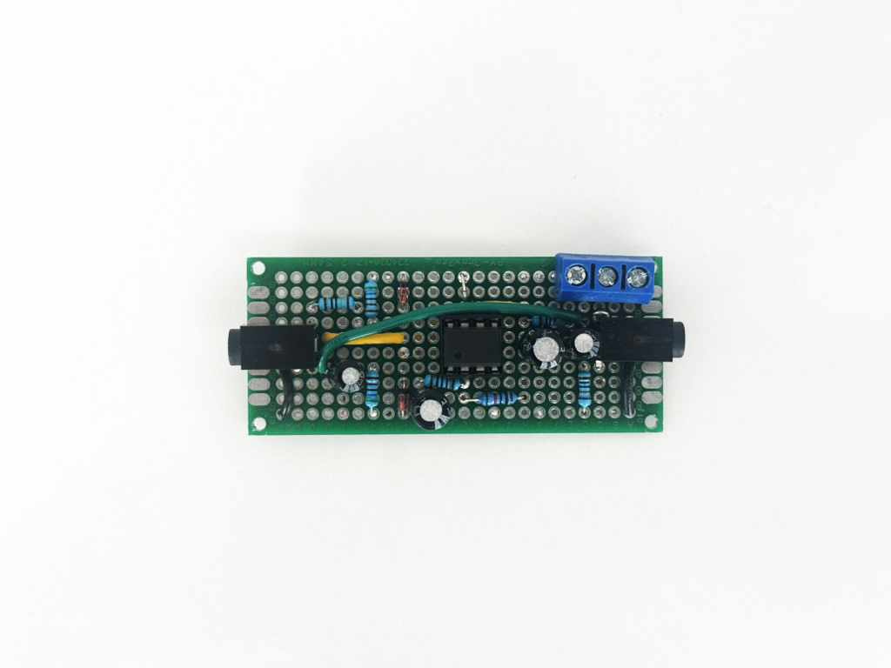
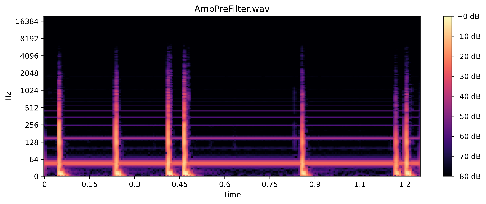

# Piezo Electric Research

## Impedance Matching Theory

As a piezo element acts like a capacitor in an electronic circuit, a typical recording setup acts like a highpass filter with the cutoff frequency determined by the capacitance of the piezo element and the resistance of the input. The formula for the cutoff frequency ($f$) is the following: 

$$
f = \frac{1}{2 \pi R C}
$$

where $R$ is the Restistance at the input, and $C$ the capacitance of the piezo element. Using typical values of
$R = 10.000\, \Omega$
and
$C = 15\,\mathrm{nF}$
the cutoff frequency is $ \approx 1061\, \mathrm{Hz}$.

To counteract the filtering of low frequency content while recording with piezo elements, it is required to match the input resistance to the capacitance of the piezo. Having a large enough input resistance, the cutoff frequency is lowered until irrelevant for the individual setup. A input impedance of $1\mathrm{M\Omega}$ results in a cutoff frequency of

$$
f = \frac{1}{2 pi (1 \times 10^{6}\,\Omega) (15 \times 10^{-9}\,\mathrm{F})} \approx 11\, \mathrm{Hz}
$$

which is below human hearing threshhold. To match the input impedance to the load of the piezo a pre-amplifying circuit is needed.

## Impedance Matching Circuit
| Circuit Schematic by Richard Mudhar. See [here](https://www.richardmudhar.com/piezo-contact-microphone-hi-z-amplifier-low-noise-version/) | Self-built Circuit |
|----------------------------------------------------------------------------------------------------------------------------------------------------------------------|---------------------------------------------------------------------------------|
|                   |  |
                                                                                                                                                    
### Usage of circuit

#### Connecting the Circuit
The input signal is connected on the left mini-jack (connected to the yellow wire).
The output signal is connected on the right mini-jack.
Power is connected through the blue terminal block, according to the polarity signs written on the terminal block. (Only 2 of 3 inputs are used).

Connect the piezo element(-s) to a stereo aux cable (TRS) and the cable to the input of the circuit. Be aware of [the following chapter](#important-signal-characteristics) while connecting the piezos.
Connect a stereo aux cable from the output of the circuit to any type of stereo line-level input of your device or split the stereo signal into two mono line-level inputs.

#### **IMPORTANT** Signal Characteristics

The circuit is built with a comparison between impedance-matched and not impedance-matched signals in mind. Therefore it accepts a stereo signal, where the left input of the signal is routed directly to the output and therefore **not amplified**, while the right signal goes through the circuit and is therefore **amplified**. Be aware to use a stereo (TRS) cable and connect the piezo to the right channel (Ring) for the impedance matched input. In hindsight it would have been smarter to have the left input connected to the circuit and the right input as throughput, so mono cables (TS) would also work, but that will probably be changed in the future.

## Measurements

|                       | Absolute dB Reference | Relative dB Reference (individual normalization) |
|-----------------------|-----------------------|--------------------------------------------------|
| Not impedance matched |                       |                                                  |
| impedance matched |                       |                                                  |

### Measurement Setup
The measurements where done with piezo elements with about $20\, \mathrm{nF}$ capacitance on inputs 0 and 1 on the [bela gem multi](https://bela.io/products/bela-gem-stereo-and-multi/) which have an adjustable input impedance between $2.5\, \mathrm{k\Omega}$ and $20\, \mathrm{k\Omega}$ according to [here](https://forum.bela.io/d/7307-audio-input-impedance).
The left column shows absolute values of the two signals (with the same dB reference) to compare overall signal strength while the right column shows the normalized signals (with individual dB references) to compare the signal-to-noise ratio.

The signal source comes from manual mechanical excitement of the piezo elements by hitting a wodden plate, with the piezos mounted on.

### Comparison

#### Signal Strength
It is clearly visible how the impedance matched input delivers far more overall signal-strength than without impedance matching, which is probably based on the amplifying function of the impedance matching circuit. This ultimately results in a better signal-to-noise ratio for the impedance-matched signal, as analog amplification only amplifies the signal while digital amplification everything that the input picks up.

#### 50 Hz Bump

However due to the high impedance of the circuit, the piezo element and especially the cabling from the piezo element to the amplification circuit is very susceptible to electromagnetic fields and basically acts as an antenna. This can be seen in the spectrogram at the $50\, \mathrm{Hz}$ mark which is picked up strongly by the circuit (especially compared to the actual signal).

#### Theoretical High Pass Filtering

It is really odd, that there is only a slight increase in lower frequency content with the impedance matched input. The absolute values show a significant difference in strength between the matched and non-matched signal, but looking at the right column, which shows the normalized signals, a visible decrease in lower frequency content for the not impedance matched signal is expected. A slight decrease can only be seen at around $70\, \mathrm{Hz}$, which does not align with the expected $\approx 1000\, \mathrm{Hz}$ cutoff. This will require further investigation.
